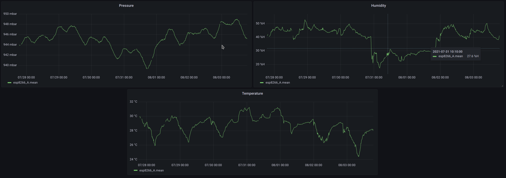

# IoT Low Cost Weather Station 

An implementation IoT low-cost infraestructure, from sensor deploy to visualization.

## Server & Stack
The server is located in a Raspberry Pi 4B 4GB  model running a headless Raspbian with an 120 GB SSD.

The RPi hosts use the IOTstack service, concretely the following containers: 

* Node-RED: For easy connection between hardware devices and software platforms.
* InfluxDB: Time series database.
* Mosquitto: MQTT server. 
* Grafana: Analytics and interactive visualization web app.

## Sensors 
The IoT is based on the  Wemos D1 Mini, a mini wifi board with 4MB flash based on ESP-8266EX. The readings are performed with de BME280, an environmental sensor with temperature, barometric pressure and humidity wich can be used in both SPI and I2C.

The ESP boards are configured in the "deep-sleep" mode because of avoiding artificial high temperatures readings due to overheating. This is even more important when the housing is so small. In this way the boards connects to wifi and the MQTT server, sends the new measures and enter in deep sleep mode for 10 minutes.

## Display 

## Useful links
* IoTStack : https://sensorsiot.github.io/IOTstack/
* Headless RPi & Networking: https://www.raspberrypi.org/documentation/configuration/wireless/headless.md

