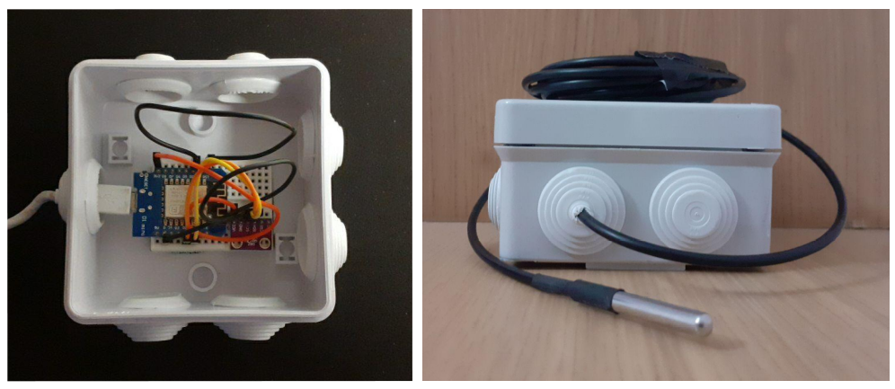

# IoT Low Cost Weather Station 

An implementation IoT low-cost infraestructure, from sensor deploy to visualization.

## Server & Stack
The server is located in a Raspberry Pi 4B 4GB  model running a headless Raspbian in a 120 GB SSD.

The RPi hosts the IOTstack service, concretely the following containers: 

* Node-RED: For easy connection between hardware devices and software platforms.
* InfluxDB: Time series database.
* Mosquitto: MQTT server. 
* Grafana: Analytics and interactive visualization web app.

## Hardware 
The IoT boards used are the Wemos D1 Mini, a mini wifi board with 4MB flash based on ESP-8266EX. The indoors readings are performed with de BME280, an environmental sensor with temperature, barometric pressure and humidity wich can be used in both SPI and I2C, in the other hand outdoors temperature is sensed with the waterproof dsb18b20.

The ESP boards are configured in the "deep-sleep" mode because of two main reasosn:

* To avoid artificial high temperatures readings due to overheating. This is even more important when the housing is so small. 
* To minimize the energy consuption, and thus improving the battery life, even lasting for many years.

In this way every 10 minutes the board connects to wifi and the MQTT server, sends the new measures and finally enters in deep sleep mode.

Left: Interior setup with bme280. Right: Exterior setup with waterproof ds18b20.

Aditonally the data is shown on a Nextion Display (NX4827T043) in which OpenWeather meteorological local data such as wind speed, min-max temperatures and weather type is also included.

The filews for the 3D case can be found in /3D folder.

## Useful links
* IoTStack : https://sensorsiot.github.io/IOTstack/
* Headless RPi & Networking: https://www.raspberrypi.org/documentation/configuration/wireless/headless.md

